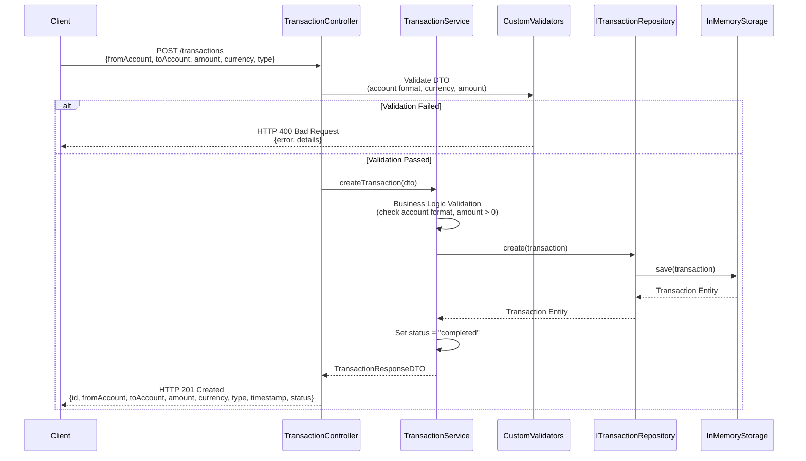
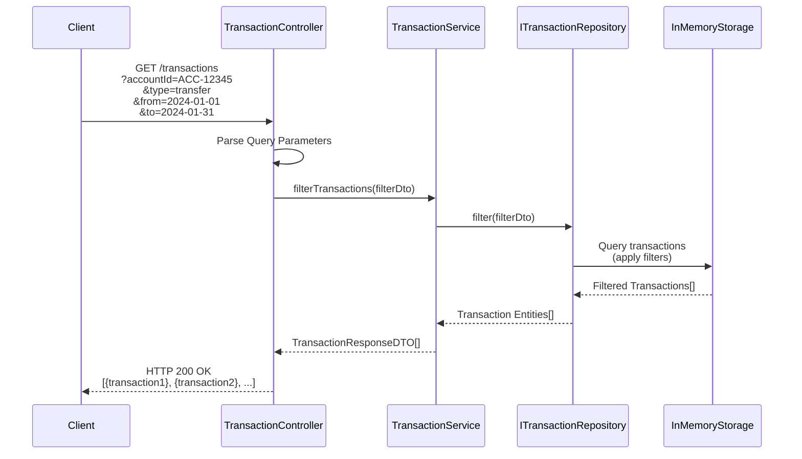
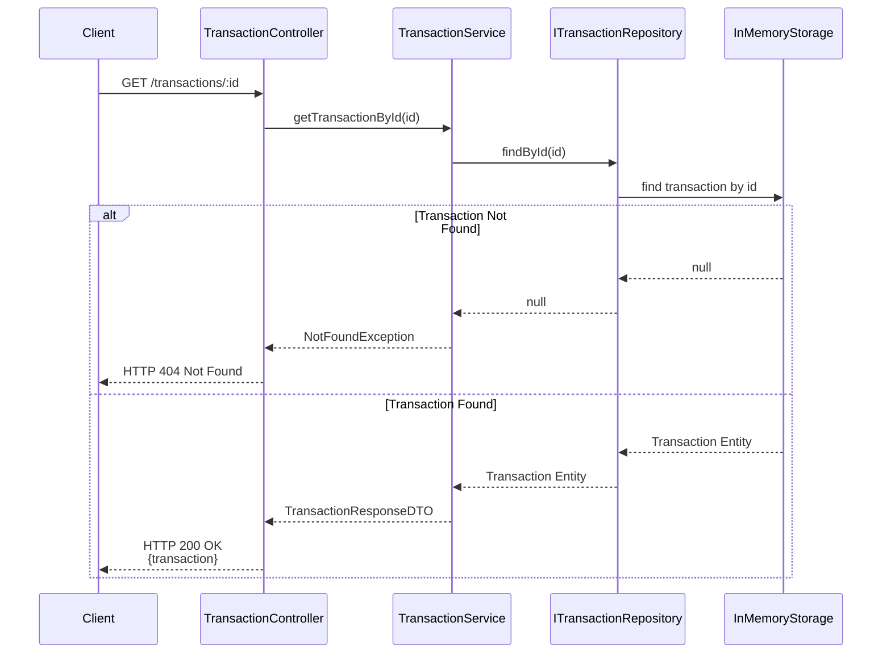
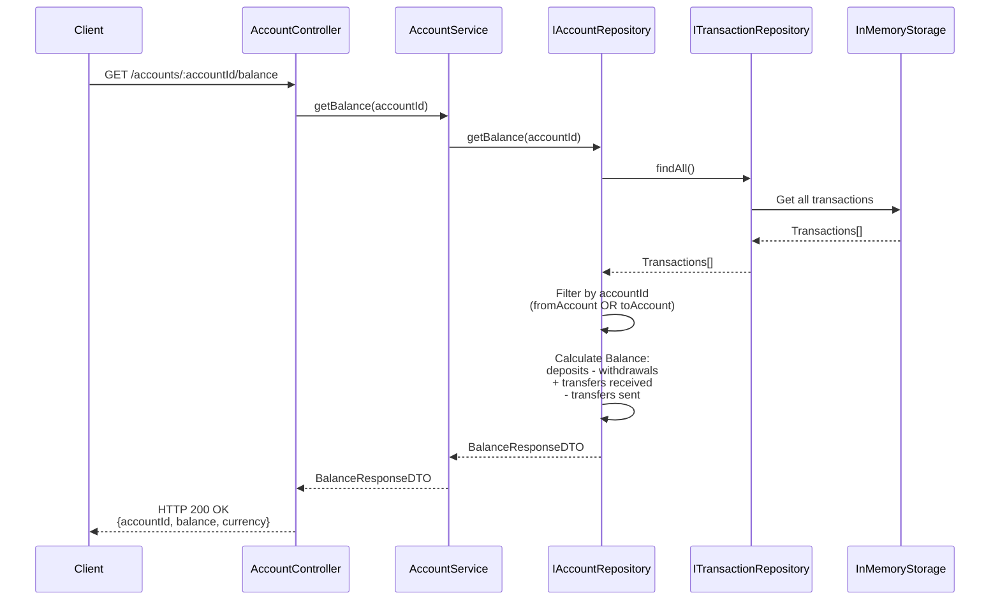
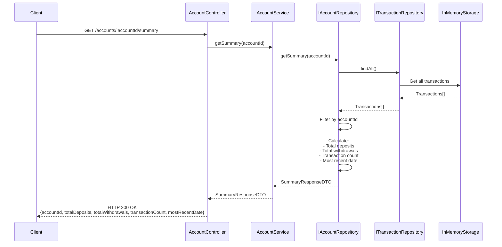

# API Endpoints Documentation

This document provides comprehensive documentation for all API endpoints in the Banking Transactions API.

## Base URL

```
http://localhost:3000
```

## Endpoints Overview

| Method | Endpoint | Description |
|--------|----------|-------------|
| `POST` | `/transactions` | Create a new transaction |
| `GET` | `/transactions` | List all transactions (with filtering) |
| `GET` | `/transactions/:id` | Get a specific transaction by ID |
| `GET` | `/accounts/:accountId/balance` | Get account balance |
| `GET` | `/accounts/:accountId/summary` | Get transaction summary for account |

---

## 1. Create Transaction

### Endpoint
```
POST /transactions
```

### Description
Creates a new banking transaction (deposit, withdrawal, or transfer).

### Request Flow



### Request Body

```json
{
  "fromAccount": "ACC-12345",
  "toAccount": "ACC-67890",
  "amount": 100.50,
  "currency": "USD",
  "type": "transfer"
}
```

### Request Parameters

| Field | Type | Required | Validation | Description |
|-------|------|----------|------------|-------------|
| `fromAccount` | string | Yes | Format: `ACC-XXXXX` (alphanumeric) | Source account identifier |
| `toAccount` | string | Yes | Format: `ACC-XXXXX` (alphanumeric) | Destination account identifier |
| `amount` | number | Yes | Positive, max 2 decimal places | Transaction amount |
| `currency` | string | Yes | ISO 4217 code (USD, EUR, GBP, JPY, etc.) | Currency code |
| `type` | string | Yes | `deposit` \| `withdrawal` \| `transfer` | Transaction type |

### Success Response

**Status Code:** `201 Created`

```json
{
  "id": "550e8400-e29b-41d4-a716-446655440000",
  "fromAccount": "ACC-12345",
  "toAccount": "ACC-67890",
  "amount": 100.50,
  "currency": "USD",
  "type": "transfer",
  "timestamp": "2024-01-15T10:30:00.000Z",
  "status": "completed"
}
```

### Error Responses

**Status Code:** `400 Bad Request` (Validation Error)

```json
{
  "error": "Validation failed",
  "details": [
    {
      "field": "amount",
      "message": "Amount must be a positive number"
    },
    {
      "field": "currency",
      "message": "Invalid currency code"
    },
    {
      "field": "fromAccount",
      "message": "Account must follow format ACC-XXXXX"
    }
  ]
}
```

**Status Code:** `400 Bad Request` (Invalid Transaction Type)

```json
{
  "error": "Invalid transaction type",
  "message": "Transaction type must be one of: deposit, withdrawal, transfer"
}
```

### Example Request

```bash
curl -X POST http://localhost:3000/transactions \
  -H "Content-Type: application/json" \
  -d '{
    "fromAccount": "ACC-12345",
    "toAccount": "ACC-67890",
    "amount": 100.50,
    "currency": "USD",
    "type": "transfer"
  }'
```

---

## 2. List All Transactions

### Endpoint
```
GET /transactions
```

### Description
Retrieves all transactions with optional filtering by account, type, and date range.

### Request Flow



### Query Parameters

| Parameter | Type | Required | Description |
|-----------|------|----------|-------------|
| `accountId` | string | No | Filter by account (matches fromAccount or toAccount) |
| `type` | string | No | Filter by transaction type (`deposit`, `withdrawal`, `transfer`) |
| `from` | string (ISO 8601) | No | Start date for date range filter (e.g., `2024-01-01`) |
| `to` | string (ISO 8601) | No | End date for date range filter (e.g., `2024-01-31`) |

**Note:** Multiple filters can be combined. All filters are applied with AND logic.

### Success Response

**Status Code:** `200 OK`

```json
[
  {
    "id": "550e8400-e29b-41d4-a716-446655440000",
    "fromAccount": "ACC-12345",
    "toAccount": "ACC-67890",
    "amount": 100.50,
    "currency": "USD",
    "type": "transfer",
    "timestamp": "2024-01-15T10:30:00.000Z",
    "status": "completed"
  },
  {
    "id": "660e8400-e29b-41d4-a716-446655440001",
    "fromAccount": "ACC-12345",
    "toAccount": "ACC-99999",
    "amount": 50.00,
    "currency": "USD",
    "type": "transfer",
    "timestamp": "2024-01-20T14:20:00.000Z",
    "status": "completed"
  }
]
```

### Example Requests

```bash
# Get all transactions
curl http://localhost:3000/transactions

# Filter by account
curl "http://localhost:3000/transactions?accountId=ACC-12345"

# Filter by type
curl "http://localhost:3000/transactions?type=transfer"

# Filter by date range
curl "http://localhost:3000/transactions?from=2024-01-01&to=2024-01-31"

# Combine multiple filters
curl "http://localhost:3000/transactions?accountId=ACC-12345&type=transfer&from=2024-01-01&to=2024-01-31"
```

---

## 3. Get Transaction by ID

### Endpoint
```
GET /transactions/:id
```

### Description
Retrieves a specific transaction by its unique identifier.

### Request Flow



### Path Parameters

| Parameter | Type | Required | Description |
|-----------|------|----------|-------------|
| `id` | string (UUID) | Yes | Unique transaction identifier |

### Success Response

**Status Code:** `200 OK`

```json
{
  "id": "550e8400-e29b-41d4-a716-446655440000",
  "fromAccount": "ACC-12345",
  "toAccount": "ACC-67890",
  "amount": 100.50,
  "currency": "USD",
  "type": "transfer",
  "timestamp": "2024-01-15T10:30:00.000Z",
  "status": "completed"
}
```

### Error Response

**Status Code:** `404 Not Found`

```json
{
  "error": "Transaction not found",
  "message": "Transaction with ID 550e8400-e29b-41d4-a716-446655440000 does not exist"
}
```

### Example Request

```bash
curl http://localhost:3000/transactions/550e8400-e29b-41d4-a716-446655440000
```

---

## 4. Get Account Balance

### Endpoint
```
GET /accounts/:accountId/balance
```

### Description
Calculates and returns the current balance for a specific account based on all transactions.

### Request Flow



### Path Parameters

| Parameter | Type | Required | Description |
|-----------|------|----------|-------------|
| `accountId` | string | Yes | Account identifier (format: `ACC-XXXXX`) |

### Balance Calculation Logic

The balance is calculated as follows:
- **Deposits**: Add to balance
- **Withdrawals**: Subtract from balance
- **Transfers received** (toAccount matches): Add to balance
- **Transfers sent** (fromAccount matches): Subtract from balance

### Success Response

**Status Code:** `200 OK`

```json
{
  "accountId": "ACC-12345",
  "balance": 1250.75,
  "currency": "USD"
}
```

### Error Response

**Status Code:** `400 Bad Request` (Invalid Account Format)

```json
{
  "error": "Invalid account format",
  "message": "Account must follow format ACC-XXXXX"
}
```

### Example Request

```bash
curl http://localhost:3000/accounts/ACC-12345/balance
```

---

## 5. Get Account Summary

### Endpoint
```
GET /accounts/:accountId/summary
```

### Description
Returns a summary of transactions for a specific account including totals, counts, and recent activity.

### Request Flow



### Path Parameters

| Parameter | Type | Required | Description |
|-----------|------|----------|-------------|
| `accountId` | string | Yes | Account identifier (format: `ACC-XXXXX`) |

### Success Response

**Status Code:** `200 OK`

```json
{
  "accountId": "ACC-12345",
  "totalDeposits": 5000.00,
  "totalWithdrawals": 2500.00,
  "transactionCount": 15,
  "mostRecentDate": "2024-01-20T14:20:00.000Z"
}
```

### Response Fields

| Field | Type | Description |
|-------|------|-------------|
| `accountId` | string | Account identifier |
| `totalDeposits` | number | Sum of all deposit transactions |
| `totalWithdrawals` | number | Sum of all withdrawal transactions |
| `transactionCount` | number | Total number of transactions (all types) |
| `mostRecentDate` | string (ISO 8601) | Timestamp of the most recent transaction |

### Error Response

**Status Code:** `400 Bad Request` (Invalid Account Format)

```json
{
  "error": "Invalid account format",
  "message": "Account must follow format ACC-XXXXX"
}
```

### Example Request

```bash
curl http://localhost:3000/accounts/ACC-12345/summary
```

---

## Common Error Responses

### 400 Bad Request
Returned when request validation fails.

```json
{
  "error": "Validation failed",
  "details": [
    {
      "field": "fieldName",
      "message": "Error message"
    }
  ]
}
```

### 404 Not Found
Returned when a requested resource does not exist.

```json
{
  "error": "Resource not found",
  "message": "Detailed error message"
}
```

### 500 Internal Server Error
Returned when an unexpected server error occurs.

```json
{
  "error": "Internal server error",
  "message": "An unexpected error occurred"
}
```

---

## Transaction Model

### Transaction Entity

```typescript
{
  id: string;              // Auto-generated UUID
  fromAccount: string;     // Format: ACC-XXXXX
  toAccount: string;       // Format: ACC-XXXXX
  amount: number;          // Positive, max 2 decimals
  currency: string;        // ISO 4217 code
  type: string;            // "deposit" | "withdrawal" | "transfer"
  timestamp: string;       // ISO 8601 datetime
  status: string;          // "pending" | "completed" | "failed"
}
```

---

## Validation Rules

### Account Format
- Pattern: `ACC-XXXXX` where X is alphanumeric (A-Z, a-z, 0-9)
- Examples: `ACC-12345`, `ACC-ABC12`, `ACC-1A2B3`

### Amount
- Must be a positive number
- Maximum 2 decimal places
- Examples: `100.50` ✓, `100.5` ✓, `100.555` ✗, `-100` ✗

### Currency
- Must be a valid ISO 4217 currency code
- Examples: `USD`, `EUR`, `GBP`, `JPY`, `CAD`, `AUD`

### Transaction Type
- Must be one of: `deposit`, `withdrawal`, `transfer`

### Date Format
- ISO 8601 format: `YYYY-MM-DD` or `YYYY-MM-DDTHH:mm:ss.sssZ`
- Examples: `2024-01-15`, `2024-01-15T10:30:00.000Z`
