# Architecture Documentation

This document describes the architecture decisions, SOLID principles implementation, and design patterns used in the Banking Transactions API.

## Clean Architecture Overview

The application follows **Clean Architecture** principles with strict separation of concerns across four main layers:

1. **Presentation Layer** - Controllers handling HTTP requests/responses
2. **Application Layer** - Services containing business logic
3. **Domain Layer** - Entities and repository interfaces
4. **Infrastructure Layer** - Concrete implementations (repositories, storage)

## Architecture Layers

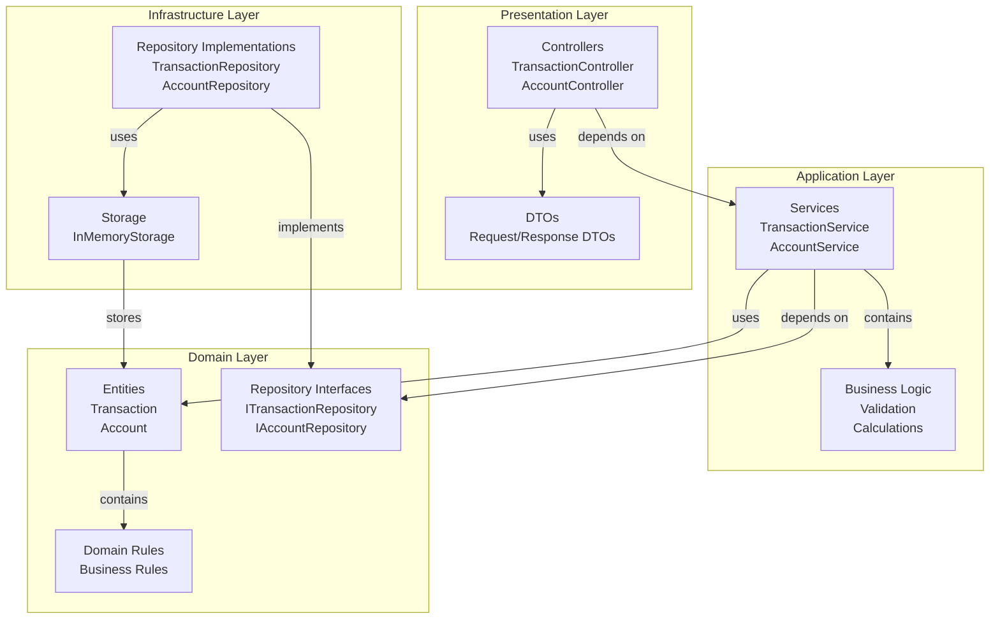

## SOLID Principles Implementation

### Single Responsibility Principle (SRP)

Each class has a single, well-defined responsibility:

#### Controllers
- **Responsibility**: Handle HTTP requests and responses only
- **Location**: `src/transaction/controllers/`, `src/account/controllers/`
- **Example**: `TransactionController` only handles HTTP routing, validation, and response formatting

```typescript
// TransactionController - Only HTTP concerns
@Controller('transactions')
export class TransactionController {
  constructor(private readonly transactionService: TransactionService) {}
  
  @Post()
  async create(@Body() dto: CreateTransactionDto) {
    return this.transactionService.createTransaction(dto);
  }
}
```

#### Services
- **Responsibility**: Contain business logic for specific domain
- **Location**: `src/transaction/services/`, `src/account/services/`
- **Example**: `TransactionService` handles transaction business logic only

```typescript
// TransactionService - Only business logic
@Injectable()
export class TransactionService {
  constructor(
    private readonly transactionRepository: ITransactionRepository,
  ) {}
  
  async createTransaction(dto: CreateTransactionDto): Promise<Transaction> {
    // Business logic here
  }
}
```

#### Repositories
- **Responsibility**: Handle data access operations only
- **Location**: `src/infra/repositories/`
- **Example**: `TransactionRepository` handles CRUD operations only

```typescript
// TransactionRepository - Only data access
@Injectable()
export class TransactionRepository implements ITransactionRepository {
  async create(transaction: Transaction): Promise<Transaction> {
    // Data access logic here
  }
}
```

### Open/Closed Principle (OCP)

The system is open for extension but closed for modification:

#### Repository Pattern
- Repository interfaces allow extension without modification
- New repository implementations can be added without changing service layer

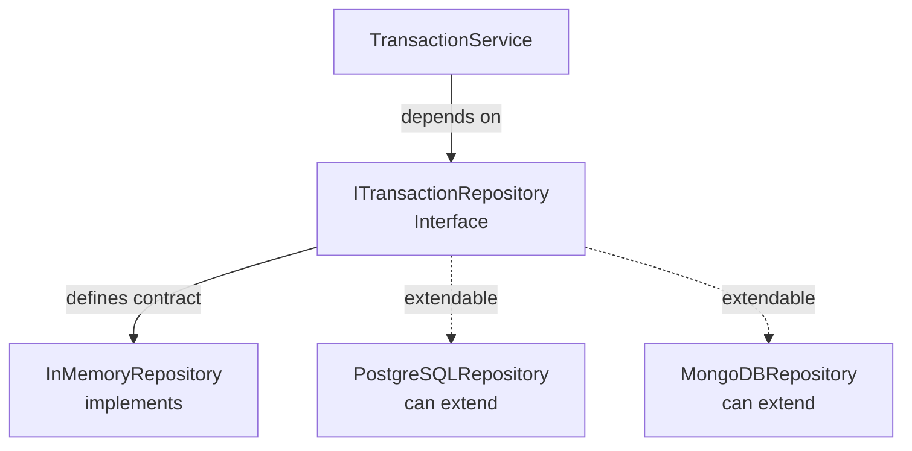

**Example:**
```typescript
// Interface - Closed for modification
export interface ITransactionRepository {
  create(transaction: Transaction): Promise<Transaction>;
  findAll(): Promise<Transaction[]>;
  findById(id: string): Promise<Transaction | null>;
}

// Implementation - Open for extension
@Injectable()
export class InMemoryTransactionRepository implements ITransactionRepository {
  // Implementation
}

// New implementation - Can be added without modifying service
@Injectable()
export class PostgreSQLTransactionRepository implements ITransactionRepository {
  // New implementation
}
```

### Liskov Substitution Principle (LSP)

Any repository implementation can replace the interface without breaking functionality:

```mermaid
sequenceDiagram
    participant Service as TransactionService
    participant Interface as ITransactionRepository
    participant Impl1 as InMemoryRepository
    participant Impl2 as PostgreSQLRepository
    
    Service -->|"depends on"| Interface
    Interface <|--|"implements"| Impl1
    Interface <|--|"implements"| Impl2
    
    Note over Service,Impl1: Can swap implementations<br/>without breaking Service
    Note over Service,Impl2: Service works with<br/>any implementation
```

**Example:**
```typescript
// Service works with any implementation
@Injectable()
export class TransactionService {
  constructor(
    // Can inject InMemoryRepository or PostgreSQLRepository
    private readonly repository: ITransactionRepository,
  ) {}
}
```

### Interface Segregation Principle (ISP)

Interfaces are focused and clients only depend on what they need:

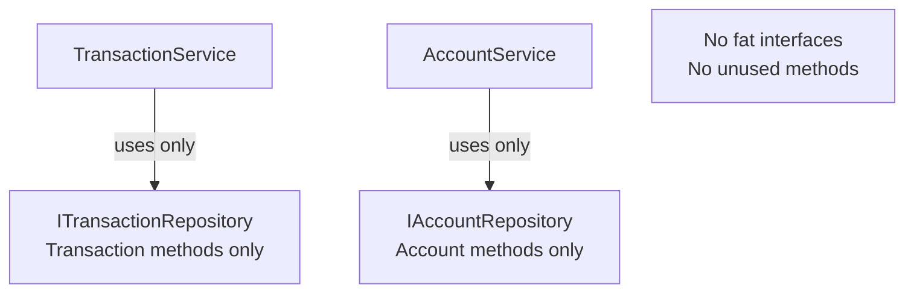

**Example:**
```typescript
// Segregated interfaces - No fat interfaces
export interface ITransactionRepository {
  create(transaction: Transaction): Promise<Transaction>;
  findAll(): Promise<Transaction[]>;
  findById(id: string): Promise<Transaction | null>;
}

export interface IAccountRepository {
  getBalance(accountId: string): Promise<Balance>;
  getSummary(accountId: string): Promise<Summary>;
}

// Services only depend on what they need
@Injectable()
export class TransactionService {
  constructor(
    private readonly transactionRepo: ITransactionRepository, // Only transaction methods
  ) {}
}

@Injectable()
export class AccountService {
  constructor(
    private readonly accountRepo: IAccountRepository, // Only account methods
  ) {}
}
```

### Dependency Inversion Principle (DIP)

High-level modules depend on abstractions, not concrete implementations:

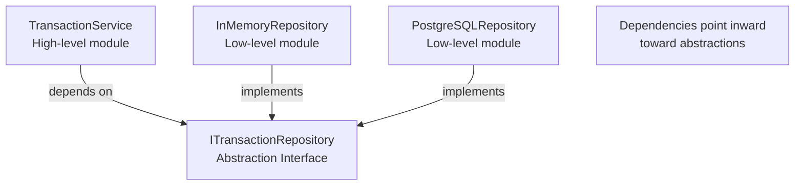

**Implementation:**
```typescript
// High-level module depends on abstraction
@Injectable()
export class TransactionService {
  constructor(
    // Depends on interface, not concrete class
    private readonly repository: ITransactionRepository,
  ) {}
}

// Low-level module implements abstraction
@Injectable()
export class InMemoryTransactionRepository implements ITransactionRepository {
  // Implementation
}

// Dependency injection in module
@Module({
  providers: [
    TransactionService,
    {
      provide: 'ITransactionRepository',
      useClass: InMemoryTransactionRepository, // Can swap implementation here
    },
  ],
})
export class TransactionModule {}
```

## Request Flow Architecture

### Complete Request Flow

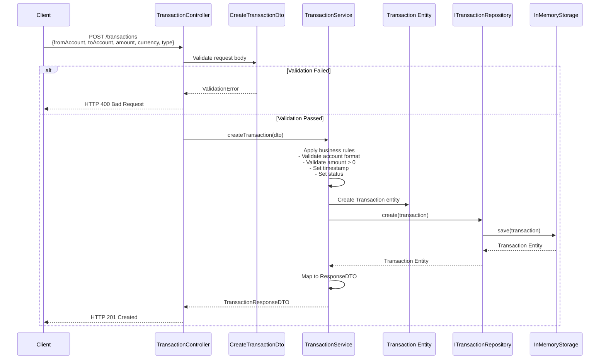

## Module Dependencies

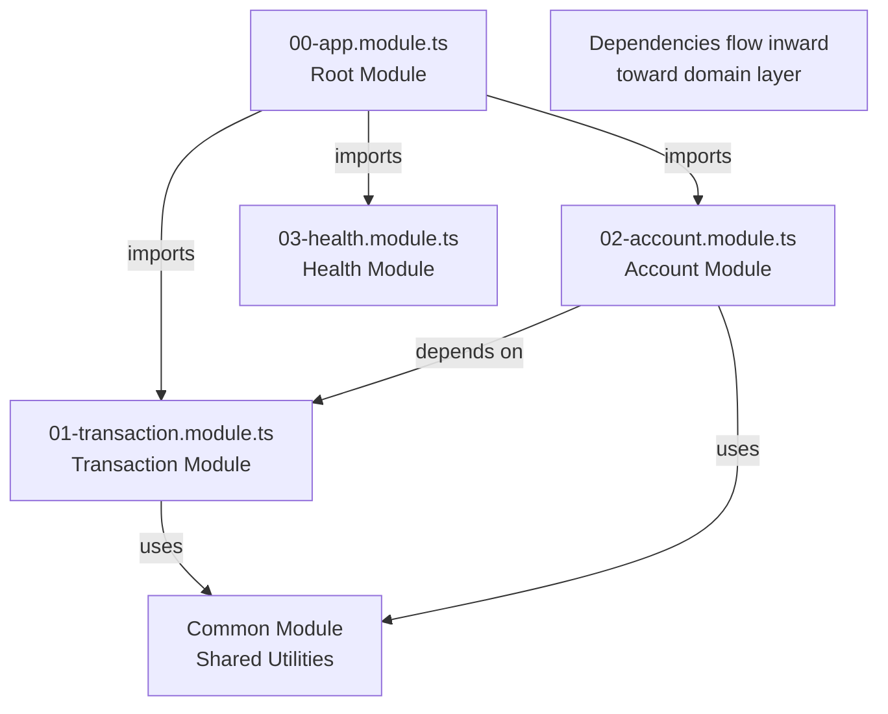

## Data Flow Architecture

### Account Balance Calculation Flow

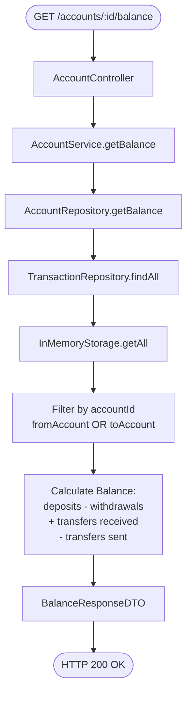

## Dependency Injection

NestJS IoC container manages dependencies:

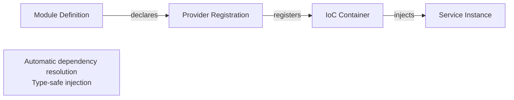

**Example:**
```typescript
@Module({
  providers: [
    TransactionService,
    {
      provide: 'ITransactionRepository',
      useClass: InMemoryTransactionRepository,
    },
  ],
})
export class TransactionModule {}
```

## Error Handling Architecture

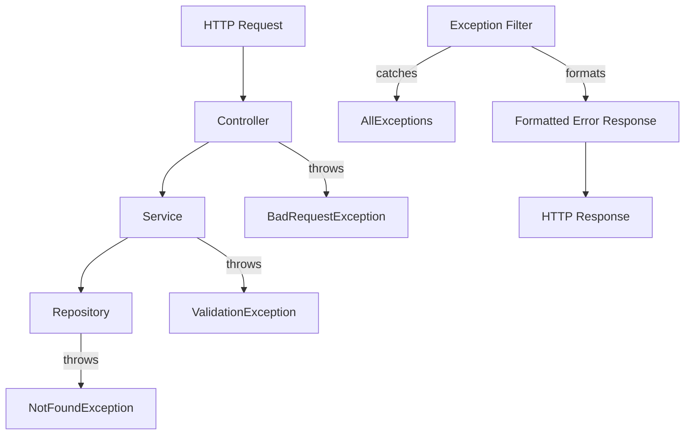

## Testing Architecture

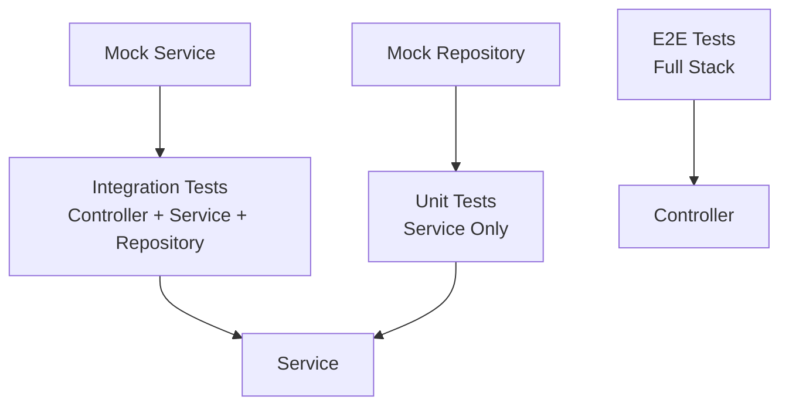

## Future Enhancements

### PostgreSQL Migration Path

The architecture supports easy migration to PostgreSQL:

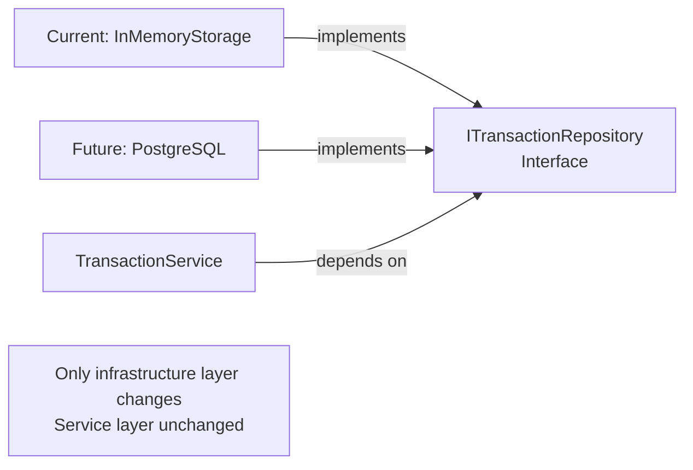

**Migration Steps:**
1. Create PostgreSQL repository implementation
2. Update module provider configuration
3. Add TypeORM entities (matching current entities)
4. Update docker-compose.yml for PostgreSQL connection
5. No changes needed in service or controller layers

## Key Design Decisions

1. **In-Memory Storage First**: Start simple, migrate to database later
2. **Repository Pattern**: Abstract data access for easy swapping
3. **DTO Pattern**: Separate request/response models from entities
4. **Exception Filters**: Centralized error handling
5. **Module Organization**: Feature-based modules with numbered prefixes
6. **Validation**: Custom validators for domain-specific rules

## Benefits of This Architecture

- **Testability**: Each layer can be tested independently
- **Maintainability**: Clear separation of concerns
- **Scalability**: Easy to add new features without breaking existing code
- **Flexibility**: Can swap implementations (storage, validation) easily
- **SOLID Compliance**: All five principles are followed throughout
