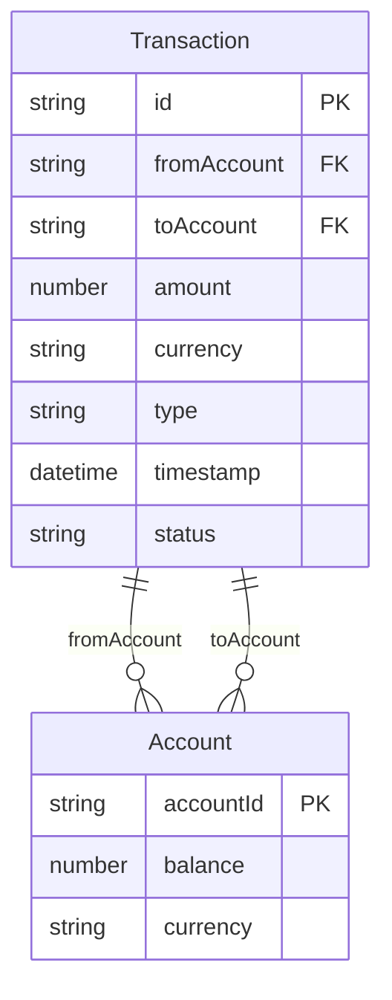
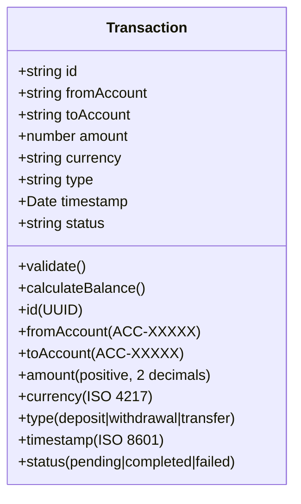
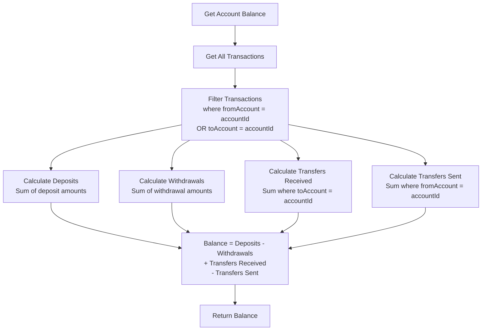
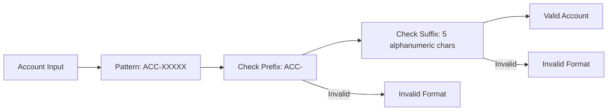
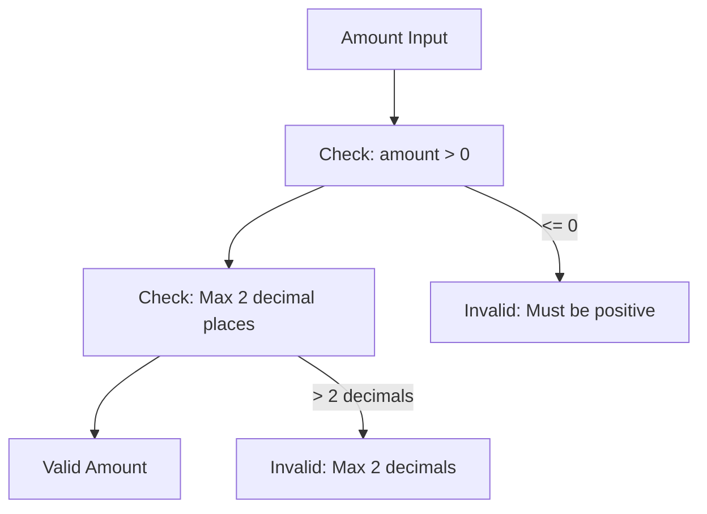
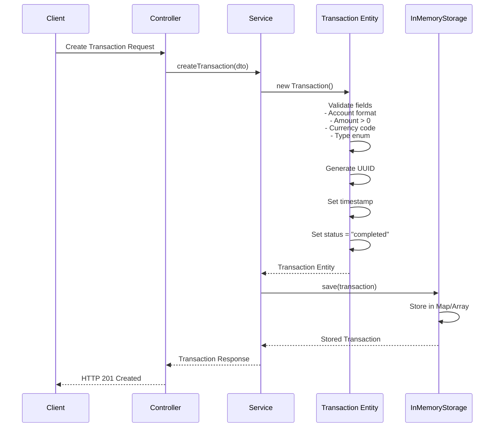
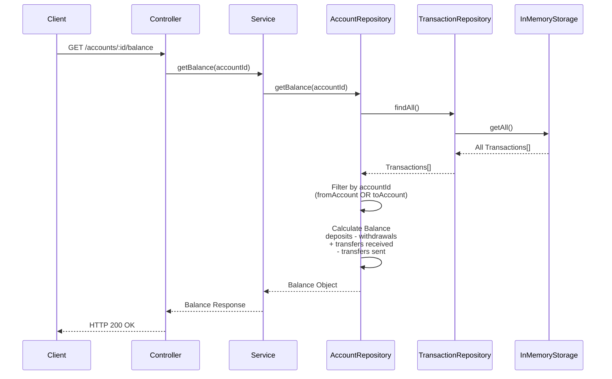
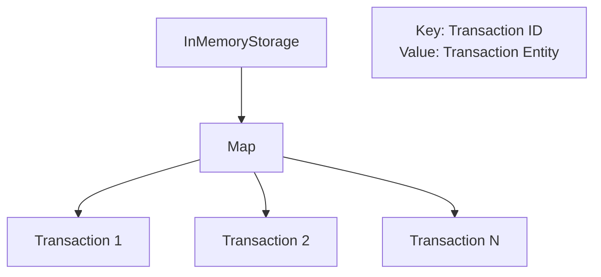

# Database Schema Documentation

This document describes the data models, entities, and their relationships in the Banking Transactions API.

## Entity Relationship Diagram



**Note:** In the current implementation, Account is a virtual entity calculated from transactions. The diagram shows the logical relationship.

## Transaction Entity

### Structure

```typescript
class Transaction {
  id: string;              // UUID, auto-generated
  fromAccount: string;     // Format: ACC-XXXXX
  toAccount: string;       // Format: ACC-XXXXX
  amount: number;          // Positive, max 2 decimal places
  currency: string;        // ISO 4217 code
  type: string;            // "deposit" | "withdrawal" | "transfer"
  timestamp: Date;         // ISO 8601 datetime
  status: string;          // "pending" | "completed" | "failed"
}
```

### Entity Diagram



### Field Descriptions

| Field | Type | Constraints | Description |
|-------|------|-------------|-------------|
| `id` | string (UUID) | Primary Key, Auto-generated | Unique transaction identifier |
| `fromAccount` | string | Format: `ACC-XXXXX`, Required | Source account identifier |
| `toAccount` | string | Format: `ACC-XXXXX`, Required | Destination account identifier |
| `amount` | number | Positive, Max 2 decimals, Required | Transaction amount |
| `currency` | string | ISO 4217 code, Required | Currency code (USD, EUR, GBP, etc.) |
| `type` | string | Enum: `deposit`, `withdrawal`, `transfer`, Required | Transaction type |
| `timestamp` | Date | ISO 8601 format, Auto-generated | Transaction creation timestamp |
| `status` | string | Enum: `pending`, `completed`, `failed`, Default: `completed` | Transaction status |

### Validation Rules

```mermaid
flowchart TD
    Start[Transaction Creation] --> ValidateAccount[Validate Account Format<br/>ACC-XXXXX pattern]
    ValidateAccount --> ValidateAmount[Validate Amount<br/>Positive, Max 2 decimals]
    ValidateAmount --> ValidateCurrency[Validate Currency<br/>ISO 4217 code]
    ValidateCurrency --> ValidateType[Validate Type<br/>deposit|withdrawal|transfer]
    ValidateType --> SetTimestamp[Set Timestamp<br/>Current DateTime]
    SetTimestamp --> SetStatus[Set Status<br/>completed]
    SetStatus --> End[Transaction Created]
    
    ValidateAccount -->|"Invalid"| Error1[Validation Error]
    ValidateAmount -->|"Invalid"| Error2[Validation Error]
    ValidateCurrency -->|"Invalid"| Error3[Validation Error]
    ValidateType -->|"Invalid"| Error4[Validation Error]
```

## Account (Virtual Entity)

### Structure

Accounts are not stored as separate entities. They are calculated from transactions.

```typescript
class Account {
  accountId: string;       // Format: ACC-XXXXX
  balance: number;         // Calculated from transactions
  currency: string;        // ISO 4217 code
}
```

### Account Balance Calculation



### Balance Calculation Formula

```
Balance = Σ(deposits) - Σ(withdrawals) + Σ(transfers_received) - Σ(transfers_sent)

Where:
- deposits = transactions where type = "deposit" AND toAccount = accountId
- withdrawals = transactions where type = "withdrawal" AND fromAccount = accountId
- transfers_received = transactions where type = "transfer" AND toAccount = accountId
- transfers_sent = transactions where type = "transfer" AND fromAccount = accountId
```

## Data Validation Rules

### Account Format Validation



**Pattern:** `ACC-[A-Za-z0-9]{5}`
- Prefix: `ACC-` (case-sensitive)
- Suffix: Exactly 5 alphanumeric characters
- Examples: `ACC-12345` ✓, `ACC-ABC12` ✓, `ACC-1a2B3` ✓, `ACC-1234` ✗, `acc-12345` ✗

### Amount Validation



**Rules:**
- Must be a positive number (> 0)
- Maximum 2 decimal places
- Examples: `100.50` ✓, `100.5` ✓, `100` ✓, `-100` ✗, `100.555` ✗

### Currency Validation

**Valid ISO 4217 Currency Codes:**
- USD (US Dollar)
- EUR (Euro)
- GBP (British Pound)
- JPY (Japanese Yen)
- CAD (Canadian Dollar)
- AUD (Australian Dollar)
- CHF (Swiss Franc)
- CNY (Chinese Yuan)
- And other valid ISO 4217 codes

### Transaction Type Validation

**Valid Types:**
- `deposit` - Money deposited into an account
- `withdrawal` - Money withdrawn from an account
- `transfer` - Money transferred between accounts

### Transaction Status

**Valid Statuses:**
- `pending` - Transaction is pending processing
- `completed` - Transaction completed successfully
- `failed` - Transaction failed

**Default Status:** `completed`

## Data Flow Diagram

### Transaction Creation Flow



### Account Balance Query Flow



## Storage Implementation

### In-Memory Storage Structure

```typescript
// Storage structure
class InMemoryStorage {
  private transactions: Map<string, Transaction>;
  
  // Storage operations
  save(transaction: Transaction): void;
  findById(id: string): Transaction | null;
  findAll(): Transaction[];
  findByAccount(accountId: string): Transaction[];
  filter(criteria: FilterCriteria): Transaction[];
}
```

### Storage Diagram



## Future PostgreSQL Schema

When migrating to PostgreSQL, the schema would be:

### Transaction Table

```sql
CREATE TABLE transactions (
    id UUID PRIMARY KEY DEFAULT gen_random_uuid(),
    from_account VARCHAR(10) NOT NULL,
    to_account VARCHAR(10) NOT NULL,
    amount DECIMAL(15, 2) NOT NULL CHECK (amount > 0),
    currency VARCHAR(3) NOT NULL,
    type VARCHAR(20) NOT NULL CHECK (type IN ('deposit', 'withdrawal', 'transfer')),
    timestamp TIMESTAMP NOT NULL DEFAULT CURRENT_TIMESTAMP,
    status VARCHAR(20) NOT NULL DEFAULT 'completed' CHECK (status IN ('pending', 'completed', 'failed')),
    CONSTRAINT valid_account_format CHECK (
        from_account ~ '^ACC-[A-Za-z0-9]{5}$' AND
        to_account ~ '^ACC-[A-Za-z0-9]{5}$'
    )
);

CREATE INDEX idx_transactions_from_account ON transactions(from_account);
CREATE INDEX idx_transactions_to_account ON transactions(to_account);
CREATE INDEX idx_transactions_type ON transactions(type);
CREATE INDEX idx_transactions_timestamp ON transactions(timestamp);
```

### Account Table (Optional)

```sql
CREATE TABLE accounts (
    account_id VARCHAR(10) PRIMARY KEY,
    currency VARCHAR(3) NOT NULL,
    created_at TIMESTAMP NOT NULL DEFAULT CURRENT_TIMESTAMP,
    CONSTRAINT valid_account_format CHECK (account_id ~ '^ACC-[A-Za-z0-9]{5}$')
);
```

## Data Integrity Rules

1. **Account Format**: All account IDs must follow `ACC-XXXXX` pattern
2. **Amount**: Must be positive with max 2 decimal places
3. **Currency**: Must be valid ISO 4217 code
4. **Transaction Type**: Must be one of: deposit, withdrawal, transfer
5. **Status**: Must be one of: pending, completed, failed
6. **Timestamp**: Automatically set on creation

## Indexing Strategy (Future PostgreSQL)

- **Primary Index**: `id` (UUID)
- **Secondary Indexes**: 
  - `from_account` (for balance calculations)
  - `to_account` (for balance calculations)
  - `type` (for filtering)
  - `timestamp` (for date range queries)
  - Composite index: `(from_account, to_account, timestamp)` for account queries
