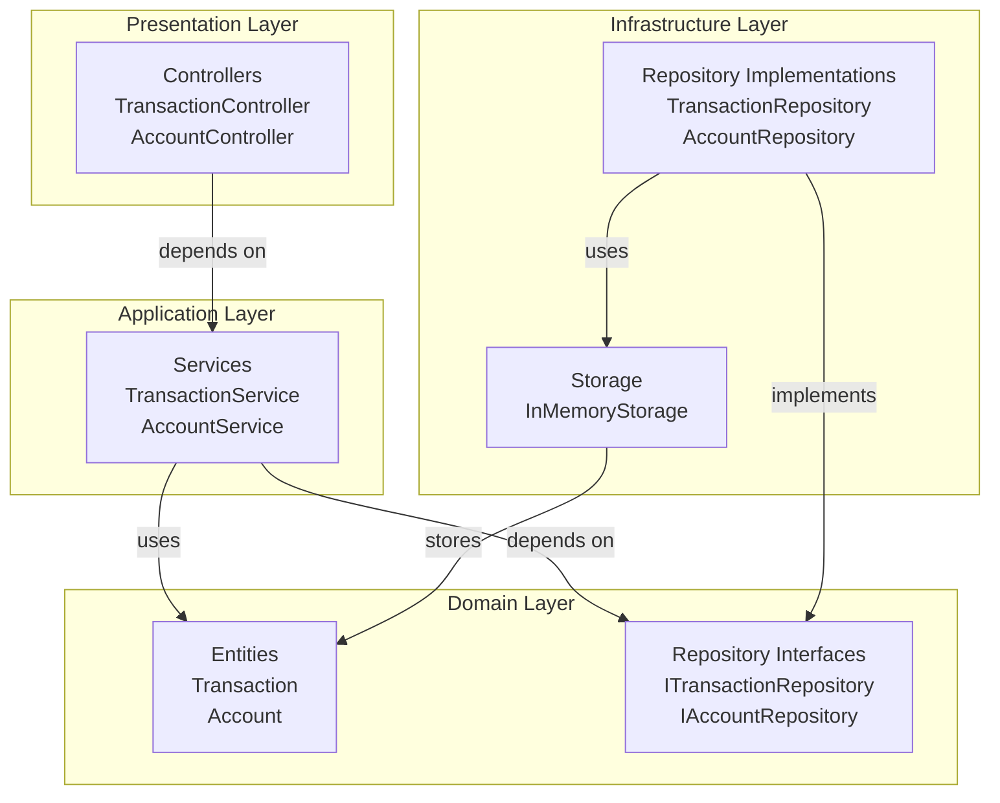
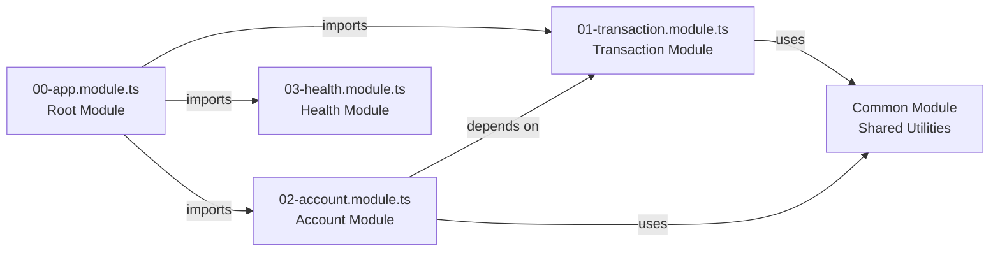
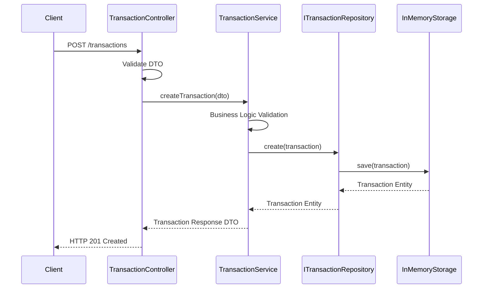

# Banking Transactions API - Implementation Plan

## Project Overview

Build a REST API for banking transactions using NestJS with TypeScript, following **very clean architecture principles** with **SOLID design approaches**. The API will handle transaction creation, retrieval, account balance queries, filtering, and transaction summaries.

This project emphasizes:
- **Clean Architecture**: Strict separation of concerns across layers (Presentation → Application → Domain → Infrastructure)
- **SOLID Principles**: Single Responsibility, Open/Closed, Liskov Substitution, Interface Segregation, Dependency Inversion
- **Testability**: Each layer can be tested independently
- **Maintainability**: Clear boundaries and dependencies between modules
- **Scalability**: Easy to extend and modify without affecting other parts

## Technology Stack

- **Framework**: NestJS with TypeScript
- **Storage**: In-memory (arrays/objects) - can be migrated to PostgreSQL later
- **Testing**: Jest for unit/integration tests
- **API Documentation**: Swagger/OpenAPI for interactive API testing and visualization
- **Architecture**: Clean Architecture with SOLID principles (Controllers → Services → Repositories → Entities)

## Architecture Overview

### Clean Architecture Layers



### Module Dependencies



## Implementation Phases

### Phase 1: Project Setup and Configuration
- Initialize NestJS project with TypeScript
- Configure Swagger/OpenAPI for API documentation
- Create folder structure following clean architecture
- Set up numbered module files (00-app.module.ts, 01-transaction.module.ts, etc.)

### Phase 2: Core Domain Layer (Entities)
- Create Transaction entity with validation decorators
- Create Account entity (if needed)

### Phase 3: Repository Layer (Interfaces)
- Define Transaction repository interface
- Define Account repository interface

### Phase 4: Infrastructure Layer (Implementations)
- Implement in-memory storage
- Implement repository concrete classes

### Phase 5: DTOs and Validation
- Create DTOs for requests and responses
- Implement custom validators (account format, currency, amount)

### Phase 6: Service Layer (Business Logic)
- Implement TransactionService
- Implement AccountService

### Phase 7: Controller Layer (API Endpoints)
- Create TransactionController with all endpoints
- Create AccountController with balance and summary endpoints

### Phase 8: Exception Handling
- Create custom exceptions
- Implement exception filters

### Phase 9: Testing
- Write unit tests
- Write integration tests
- Write E2E tests

### Phase 10: Documentation and Demo Files
- Complete API documentation
- Create demo files and sample requests

## Documentation Files

- **[01-api-endpoints.md](./01-api-endpoints.md)** - Complete API endpoint documentation with sequence diagrams
- **[02-architecture.md](./02-architecture.md)** - Architecture decisions and SOLID principles implementation
- **[03-database-schema.md](./03-database-schema.md)** - Data models and entity relationships

## Key Features

### Transaction Management
- Create transactions (deposit, withdrawal, transfer)
- List all transactions with filtering
- Get transaction by ID
- Filter by account, type, and date range

### Account Management
- Get account balance
- Get transaction summary (deposits, withdrawals, count, recent date)

### Validation
- Amount validation (positive, max 2 decimals)
- Account format validation (ACC-XXXXX)
- Currency validation (ISO 4217 codes)

## Request Flow Example



## SOLID Principles Implementation

### Single Responsibility Principle (SRP)
- **Controllers**: Handle HTTP requests/responses only
- **Services**: Contain business logic for specific domain
- **Repositories**: Handle data access operations only
- **Entities**: Represent domain models with business rules

### Open/Closed Principle (OCP)
- Repository interfaces allow extension without modification
- New repository implementations can be added without changing service layer

### Liskov Substitution Principle (LSP)
- Any repository implementation can replace the interface without breaking functionality

### Interface Segregation Principle (ISP)
- Separate interfaces for TransactionRepository and AccountRepository
- Services only depend on interfaces they actually use

### Dependency Inversion Principle (DIP)
- High-level modules (Services) depend on abstractions (Repository interfaces)
- Low-level modules (Infrastructure) implement these abstractions
- Dependency injection through NestJS IoC container

## API Documentation & Testing

### Swagger UI

Once the application is running, access the interactive Swagger documentation at:

**http://localhost:3000/api**

The Swagger UI provides:
- Complete API documentation
- Interactive endpoint testing
- Request/response examples
- Schema definitions
- Try-it-out functionality

### Running the Application

```bash
# Install dependencies
npm install

# Start development server
npm run start:dev

# Access Swagger UI
# Open browser: http://localhost:3000/api
```

## Next Steps

1. Review [API Endpoints Documentation](./01-api-endpoints.md) for detailed endpoint specifications
2. Review [Architecture Documentation](./02-architecture.md) for SOLID principles and design decisions
3. Review [Database Schema Documentation](./03-database-schema.md) for entity structures
4. Test APIs using Swagger UI at `/api` endpoint
